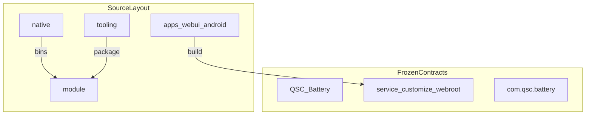

# QSC-Battery Architecture

Engineering map for contributors. **Frozen runtime contracts** must not change without an explicit migration plan; this document also records naming and layout conventions for the monorepo.

## Frozen runtime contracts

Changing any of the following breaks upgrades for existing installs. Refactor source layout, build wiring, and file splits instead.

| Contract                        | Value / path                                                                             |
| ------------------------------- | ---------------------------------------------------------------------------------------- |
| Magisk module id                | `QSC_Battery`                                                                            |
| Install path                    | `/data/adb/modules/QSC_Battery`                                                          |
| Magisk entry filenames          | `module.prop`, `service.sh`, `customize.sh`, `uninstall.sh`, `action.sh`, `META-INF/...` |
| Runtime layout                  | `config/config.conf`, `data/*`, `bin/*`, `webroot/`                                      |
| Android applicationId / package | `com.qsc.battery`                                                                        |
| Release asset habit             | `QSC-Battery_v*`                                                                         |
| Update / Pages URLs             | existing `update.json` / `app-update.json` / Pages channels                              |

Persisted config keys stay `snake_case` (`power_stop`, `off_qsc`, …). Do **not** mass-rename keys or `QSCV_*` env vars.

Optional CI guard: grep workflows / PR checks should fail if `id=QSC_Battery` or `applicationId = "com.qsc.battery"` drift accidentally.

## Top-level layout

```text
QSC-Battery/
  apps/
    apps/webui/              # Vue 3 + Vite WebUI → builds into module/webroot
    android/            # Companion APP (Compose); Gradle project root
  module/               # Magisk delivery surface (stable entry names)
    bin/ lib/ config/ webroot/ META-INF/
    module.prop service.sh customize.sh uninstall.sh action.sh ...
  native/
    qscd-rust/          # Event waiter (Rust) → module bin qscd-arm64|arm
    qscd-c/             # Event waiter (C) → module bin qscdc-arm64|arm
    qsc-cli/            # Optional native CLI
  tooling/
    scripts/
      build/ package/ release/ test/   # grouped by concern (legacy flat names still OK via path)
    docs/ or BUILD.md RELEASE.md
  docs/                 # VitePress user docs → GitHub Pages
  archives/
  .github/
  changelog.md
  package.json
  ARCHITECTURE.md
  README.md
```

- Keep `module/` at the top level for Magisk contributor familiarity.
- Use `apps/` for multi-client products (WebUI + Android).
- Do **not** invent a shared Kotlin/Vue runtime package.



## Naming conventions

| Area             | Convention                                              |
| ---------------- | ------------------------------------------------------- |
| Tooling scripts  | kebab-case (`build-web.mjs`, `package-module.mjs`)      |
| Vue / TypeScript | PascalCase components, camelCase functions              |
| Kotlin           | Android official style                                  |
| Shell helpers    | `qsc_*` function prefix; keep Magisk entry script names |
| Config keys      | `snake_case` (existing + new)                           |
| Daemon artifacts | see table below — do not invent parallel names          |

Enforce conventions on **new / touched** code; avoid one-shot renames of persisted keys or Magisk id.

## Daemon name mapping

| Role           | Source directory    | On-module binary habit                                | CI / release asset habit            |
| -------------- | ------------------- | ----------------------------------------------------- | ----------------------------------- |
| Rust waiter    | `native/qscd-rust/` | `qscd-arm64`, `qscd-arm` (active symlink/copy `qscd`) | `qscd-rust-*` / rust channel assets |
| C waiter       | `native/qscd-c/`    | `qscdc-arm64`, `qscdc-arm` (active `qscdc`)           | `qscd-c-*` / c channel assets       |
| Shell fallback | (module scripts)    | no separate daemon bin                                | `native=sh` / lite packaging        |

Rust and C implementations share CLI surface and exit codes; Magisk install may offer either. WebUI / APP talk to module helpers (`qscd_fetch.sh`), not to crate paths.

## Oversized source guidance

Prefer business source files under ~500 lines (harder ceiling ~800). Generated assets and long switch-node lists may exceed that. Prefer thin Magisk entry scripts that `source` domain libs under `module/bin/lib/` (and `module/install/` for customize fragments).

## Versioning policy

- **Module display version** (`module.prop` `version=`): release stamp / CI stamp owns this (date-aligned display + `versionCode`).
- **Root `package.json` `version`**: npm metadata only; sync from `module.prop` via `node tooling/scripts/sync-package-version.mjs` when cutting a release (maps `2026.09.16` → `20260916.0.0`). Do not hand-edit drift.
- **APP `versionName` / `versionCode`**: Gradle properties / packaging scripts; same date-aligned `versionCode` policy as module where applicable.

## Debug / packaging hygiene

- Debug-only scripts and `package:module:debug` stay out of the default contributor “happy path” docs; primary commands are `build:web`, `build:module`, `package:module`, `check`.
- Do not ship debug-only helpers into user-facing Magisk zips unless explicitly selected by a packaging flag.

## Where to start

| Want…                         | Go to…                                                                     |
| ----------------------------- | -------------------------------------------------------------------------- |
| Magisk install / boot loop    | `module/customize.sh`, `module/service.sh`                                 |
| Stop-charge / current / saver | `module/bin/qsc_switch.sh`, `module/bin/lib/`                              |
| WebUI                         | `apps/webui/`                                                              |
| Companion APP                 | `apps/android/`                                                            |
| qscd build                    | `native/qscd-rust/`, `native/qscd-c/`, `tooling/scripts/build-native*.mjs` |
| Release / CI                  | `tooling/RELEASE.md`, `.github/workflows/`                                 |
