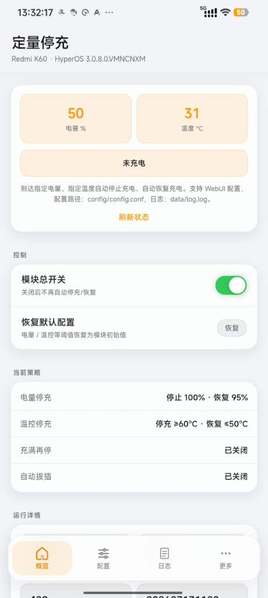
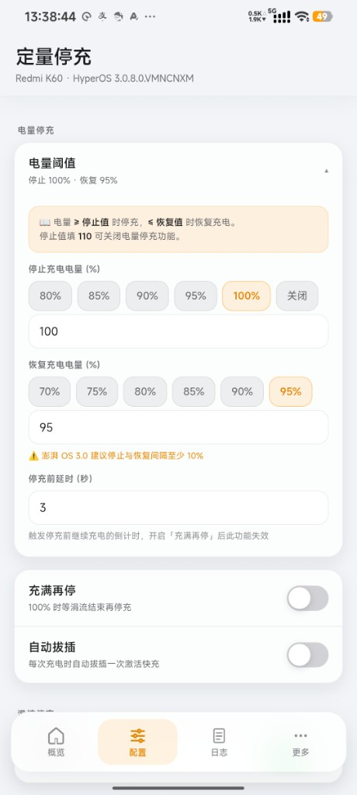
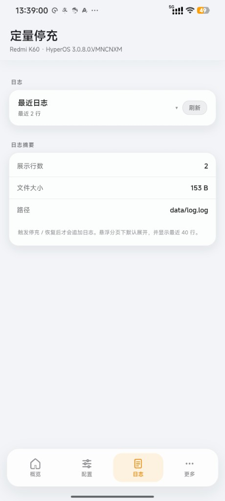
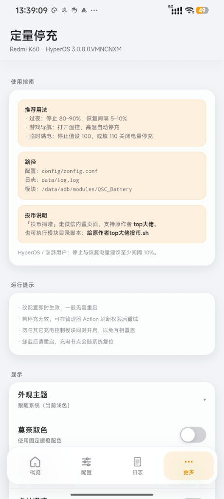

# QSC 定量停充（WebUI 版）

基于 **top大佬** 原作，由 **许小墨** 维护 WebUI。

到达指定电量 / 温度自动停充与恢复，支持 Magisk / KernelSU WebUI 配置。

- **本仓库**：[Eikeitsu/QSC-Battery](https://github.com/Eikeitsu/QSC-Battery)
- **在线文档**：[eikeitsu.github.io/QSC-Battery](https://eikeitsu.github.io/QSC-Battery/)
- **原作**：[410154425/QuantitativeStopCharging_switch_magisk](https://github.com/410154425/QuantitativeStopCharging_switch_magisk)

## WebUI 预览

|                        概览                         |                       配置                        |
| :-------------------------------------------------: | :-----------------------------------------------: |
|  |  |

|                      日志                      |                      更多                       |
| :--------------------------------------------: | :---------------------------------------------: |
|  |  |

## 功能概览

- 电量 / 温度阈值停充与恢复；多条件同时触发时，全部达到恢复条件后才重新充电
- 充满再停、自动拔插
- 可选 WebUI：状态、配置、日志；主题 / 莫奈取色 / 悬浮分页 / 卡片紧凑等显示选项
- 更新时可用音量键选择保留原配置或恢复默认配置
- 模块 id：`QSC_Battery`；支持 `updateJson` 在线更新

## 快速开始（用户）

1. 从 [Releases](https://github.com/Eikeitsu/QSC-Battery/releases) 下载 zip
2. 刷入模块，按音量键确认安装并选择是否安装 WebUI
3. 更新安装时选择保留原配置或使用新版默认配置
4. 重启后通过 WebUI 或 `config/config.conf` 调整阈值

从旧版 `QuantitativeStopCharging_switch` 升级时，安装脚本会**自动卸载旧版模块**（不迁移配置），请在 WebUI 重新设置。

详细说明见 [在线文档](https://eikeitsu.github.io/QSC-Battery/) 或 `docs/`。

## 仓库结构

```text
module/          # Magisk 模块本体（与工具、文档分离）
  webroot/       # WebUI 可读源码
docs/            # 用户文档（VitePress → GitHub Pages）
  public/screenshots/  # WebUI 截图
tooling/         # 构建脚本与维护者说明（见 tooling/BUILD.md）
.github/         # CI 工作流
```

## 本地开发（维护者）

```bash
npm install
npm run dev:web
npm run build:module
```

构建说明见 [`tooling/BUILD.md`](tooling/BUILD.md)。

发版：Actions → **Release Module** → Run workflow（填写版本号），或推送 `v*` 标签。

## 致谢

感谢 **top大佬** 开源 [QSC 定量停充](https://github.com/410154425/QuantitativeStopCharging_switch_magisk)。
